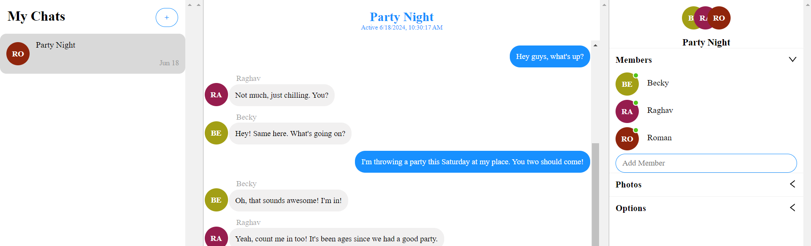
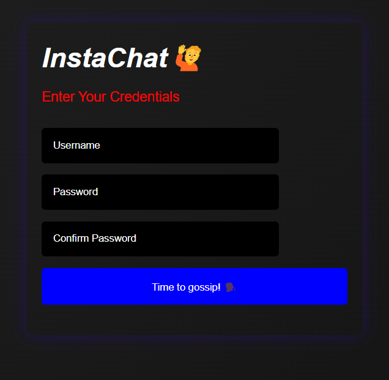
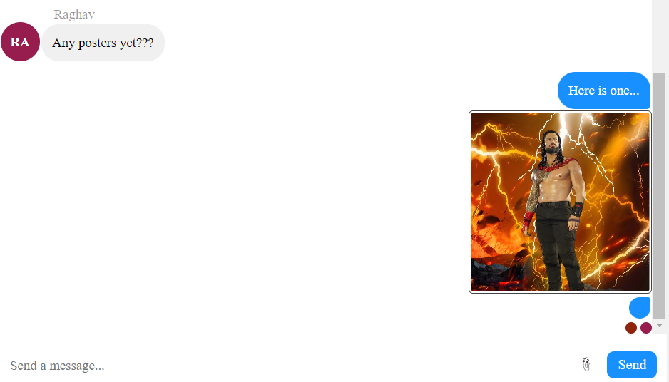

# InstaChat



This is a chat application built using [Node.js](https://nodejs.org/en) for the backend, [React.js](https://legacy.reactjs.org/) with [Vite](https://vitejs.dev/) for the frontend, and leveraging the features of [ChatEngine.io](https://chatengine.io/) alongside [React-Chat-Engine Advanced](https://www.npmjs.com/package/react-chat-engine-advanced) for real-time messaging functionalities.


## Features:


- **Group Chat**: Create and participate in group chats with multiple friends, facilitating seamless communication within a shared space.
- **User Authentication**: Securely authenticate users to ensure privacy and data security.
- **Image Share and Customizable UI**: Share images within conversations and provide a personalized chat experience.

## Tech Stack:

- **Frontend**: React.js with Vite
- **Backend** : Node.js
- **Language**: JavaScript
- **Styling**:  CSS
- **Authentication**: ChatEngine.io

## App in Action:

- **Sign-In Page** 


- **Share Images** 



## Setup:

### Prerequisites:

Before running the application, ensure you have the following prerequisites installed:

1. Node.js and npm/yarn
2. ChatEngine.io account and API key

### Installation

1. Clone the Repository:

  ```bash
     git clone <repository_url>

2. Navigate to the Frontend Directory and Install Dependencies:

   cd frontend
   npm install

3. Start the Frontend Server:

   npm run dev

4. Navigate to the Backend Directory and Install Dependencies:
   
   cd ../backend
   npm install

5. Start the Backend Server:

   npm start

6. Open Your Browser:

   Open your browser and visit http://localhost:3000 to access the chat application.
